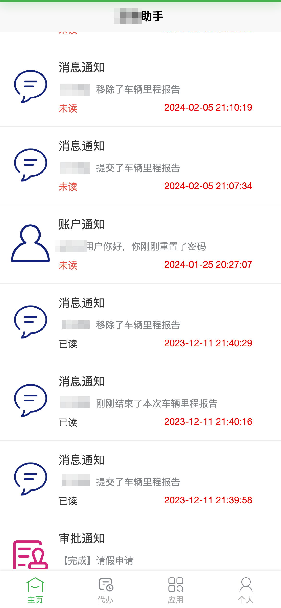

## 项目介绍

晁泽家禽全产业链ERP管理信息系统是一套专门针对于现代化家禽行业特点、凝聚多年家禽企业管理经验开发的全产业链ERP管理软件，适用于大中小型养殖企业。

晁泽家禽全产业链ERP管理信息系统涵盖企业生产经营的各个流程，对企业的销售、生产、采购、技术、成本管控以及各仓库进行全方位的管理与监控。

帮助养殖企业规范业务流程，充分合理利用现有资源，改善管理混乱局面，提高管理水平，降低运营成本，提升企业竞争力。

定制性的系统框架实现对企业特殊的流程或需求进行再开发，适应企业在发展过程中遇到的新要求，使企业真正拥有标准统一、可拓展的信息数据管理平台。

## 系统功能

### 适用场景

- 公司+基地+农户、公司+家庭农场、公司+合作社+农户、公司+农户 等农业种养殖模式的企业集团；
- 小规模养殖场、养殖散户、家庭农场、生态种养殖场等种养殖户单独使用；
- 养殖扩繁场（猪/鸡/牛/羊等）+小规模养殖场场的种养殖模式。

### “公司+养户” 模式

## 技术栈

#### 开发环境
- 语言：Java 8+ (小于17)
- IDE(JAVA)： IDEA (必须安装lombok插件 )
- IDE(前端)： Vscode、WebStorm、IDEA
- 依赖管理：Maven
- 缓存：Redis
- 数据库脚本：MySQL5.7（其他数据库，[需要自己转](https://my.oschina.net/jeecg/blog/4905722)）

#### 后端
- 基础框架：Spring Boot 2.6.6
- 微服务框架： Spring Cloud Alibaba 2021.0.1.0
- 持久层框架：MybatisPlus 3.5.1
- 报表工具： JimuReport 1.6.4
- 安全框架：Apache Shiro 1.8.0，Jwt 3.11.0
- 微服务技术栈：Spring Cloud Alibaba、Nacos、Gateway、Sentinel、Skywalking
- 数据库连接池：阿里巴巴Druid 1.1.22
- 日志打印：logback
- 其他：autopoi, fastjson，poi，Swagger-ui，quartz, lombok（简化代码）等。

#### 前端
- 基础框架：[ant-design-vue](https://github.com/vueComponent/ant-design-vue) - Ant Design Of Vue 实现
- JavaScript框架：Vue2
- node 12.13
- yarn
- @vue/cli 3.2.1
- [vue-cropper](https://github.com/xyxiao001/vue-cropper) - 头像裁剪组件
- [@antv/g2](https://antv.alipay.com/zh-cn/index.html) - Alipay AntV 数据可视化图表
- [Viser-vue](https://viserjs.github.io/docs.html#/viser/guide/installation)  - antv/g2 封装实现
- [Vue 2.6.10](https://cn.vuejs.org/),[Vuex](https://vuex.vuejs.org/zh/),[Vue Router](https://router.vuejs.org/zh/)
- [Axios](https://github.com/axios/axios)
- [webpack](https://www.webpackjs.com/),[yarn](https://yarnpkg.com/zh-Hans/)
- eslint，[@vue/cli 3.2.1](https://cli.vuejs.org/zh/guide)
- vue-print-nb-jeecg - 打印

## 四、商用

完整项目应用，添加微信咨询

## 五、项目演示
### 手机模块

#### 登陆

##### 登陆选择租户

### 主页

### 流程待办

### 应用

#### 养户模块

#### 领物登记

#### 侧重

#### 日报

### 其他......

### 个人

### PC端

略......
